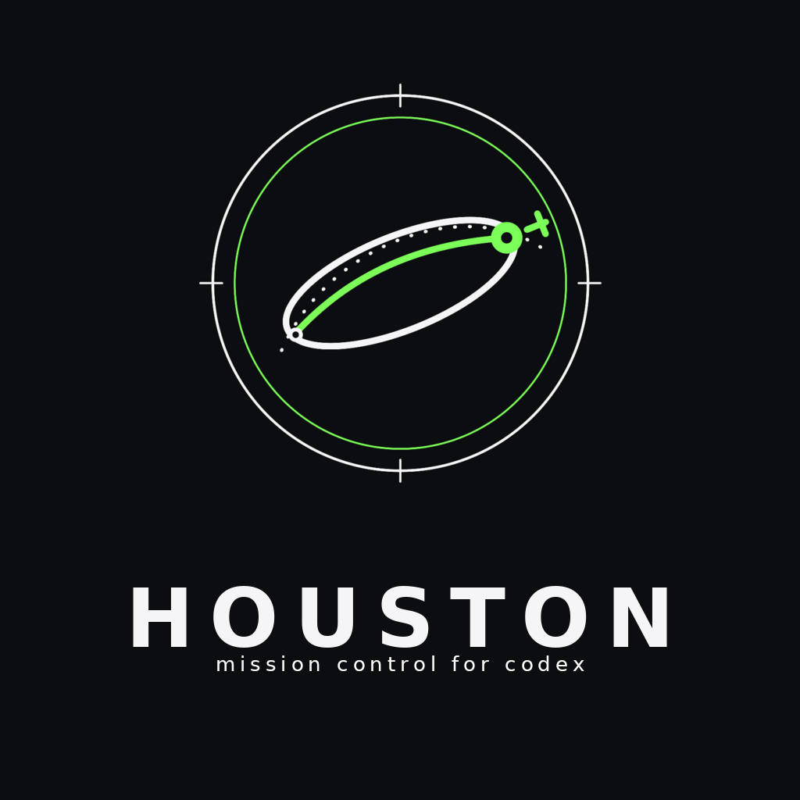

# houston

<p align="center">
  
</p>

> Mission control for Codex. Durable, harness-agnostic mission mode — bootlegged.

Codex `goal` mode is good at the *verify* half of a loop: set a target, run until it goes green. But the goal lives and dies inside one session. Close the terminal and the mission is gone — no record of what it was meant to do, how far it got, or what's left.

Factory ships mission mode (durable `mission.md` / `features.json` / `validation-contract.md` / handoffs) but it lives in `.factory` and belongs to Factory.

`houston` gives Codex its **own** mission state. New missions live under `~/.codex/missions`. Factory missions become an *import source*, not the home.

## What it does

- **Create** a Codex-native mission for any feature, stored under `$CODEX_HOME/missions`.
- **Import** a legacy `.factory` mission (mirror the spine, record the source).
- **Run / resume** a mission with a portable dynamic loop: `warm start → classify → inspect → plan → execute → validate → repair → handoff`.
- **Reconcile** mission metadata against real git/source/test truth — never trust stale state.
- **Fan out** subagents (implement → red-team → verify) when you ask for it.
- **Gate** completion on a named validation contract, not a vibe.

The loop is harness-agnostic by design: the same shape runs on Codex tools, Claude Workflow JS, Factory workers, or a plain sequential fallback.

## Install

`houston` is a **Codex** skill. It installs into your Codex skills directory, not Claude's.

```bash
git clone https://github.com/<you>/houston
cp -r houston/skill ~/.codex/skills/houston
```

Or symlink for development:

```bash
ln -s "$(pwd)/houston/skill" ~/.codex/skills/houston
```

Codex loads the skill by its `name:` field (`houston`), independent of the folder name.

## Quick start

```bash
# create a Codex-native mission for new feature work
skill/scripts/create_mission.py --cwd "$PWD" \
  --title "Kelly Criterion" \
  --objective "Add Kelly position sizing with a /kelly command, helper, docs, tests"

# find the active mission for this repo
skill/scripts/find_mission.py --cwd "$PWD" --latest

# import a legacy Factory mission instead of starting fresh
skill/scripts/import_factory_mission.py ~/.factory/missions/<id>

# see status + recent log
skill/scripts/summarize_mission.py ~/.codex/missions/<mission>
```

Then, inside Codex, point it at the mission and let the dynamic loop run. Ask for subagents/fanout explicitly to authorize parallel workers.

## Receipt

Ran on a real repo (`macd-bot`), not a toy. Mission: implement Kelly Criterion position sizing.

- Mission created Codex-native under `~/.codex/missions/kelly-criterion` (not `.factory`).
- Reconciled mission state against `git status` before touching code.
- Fanned out a subagent that owned the test file on a disjoint write set.
- Gated completion on the validation contract: **57 tests green** before the mission closed.
- Produced a handoff with exact changed files, commands, and results.

## Mission state, in one rule

`~/.codex/missions` is the home. `.factory` is read/import-only. Source and tests decide what's actually done — mission metadata is a claim until it's reconciled.

## Layout

```
houston/
├── README.md
└── skill/
    ├── SKILL.md                  # the skill definition (name: houston)
    ├── agents/openai.yaml
    ├── references/
    │   ├── dynamic-workflow.md          # the portable loop
    │   ├── harness-agnostic-workflows.md# adapter rules per harness
    │   └── factory-schema.md            # Factory mission shape (for import)
    └── scripts/
        ├── create_mission.py
        ├── import_factory_mission.py
        ├── find_mission.py
        └── summarize_mission.py
```

## License

MIT
